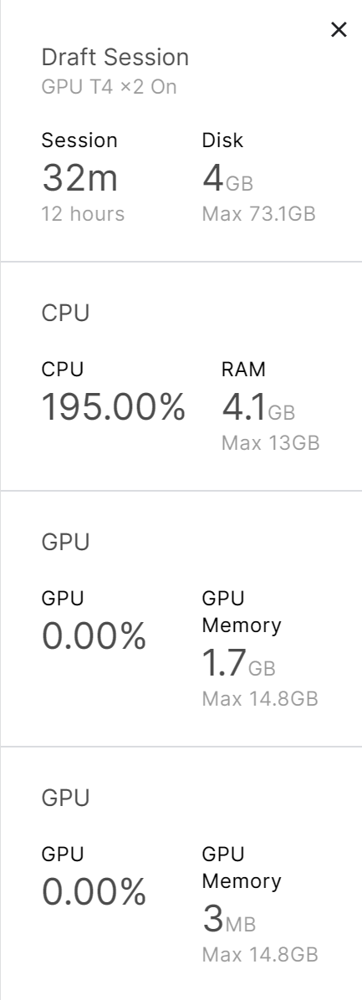

### dogs-vs-cats-redux-kernels-edition

#### 数据集制作

```python
# 定义图像的预处理方式
transform = transforms.Compose([
    transforms.Resize(256),  # 图像大小调整为256*256
    transforms.CenterCrop(224),  # 从中心裁剪出224*224大小的图片
    transforms.ToTensor(),  # 将图像转换为PyTorch张量
    # 在各个通道上，用这些均值和方差进行归一化，这些值是在ImageNet上得到的
    transforms.Normalize(mean=[0.485, 0.456, 0.406], std=[0.229, 0.224, 0.225])
])
```

transform是将各种不同尺寸的图像进行处理成同大小，同分布的tensor。

理论上应该在图片上进行各种不同部分的裁剪以提升泛化性，该工作暂时没做

```python
class myDataSet(Dataset):
    def __init__(self, path, transform=None):
        self.path = path
        self.transform = transform
        self.image_list = []
        self.label_list = []

        with zipfile.ZipFile(path, 'r') as zip_file:
            # 遍历zip_file
            for file_name in zip_file.namelist():
                if file_name.endswith('.jpg') or file_name.endswith('.png'):
                    label = file_name.split('.')[0]
                    self.image_list.append(file_name)
                    self.label_list.append(0.0 if label == 'train/cat' else 1.0)

    def __len__(self):
        return len(self.image_list)

    def __getitem__(self, idx):
        image_path = self.image_list[idx]
        with zipfile.ZipFile(self.path, 'r') as zip_file:
            with zip_file.open(image_path) as image_file:
                image = Image.open(BytesIO(image_file.read()))

        if self.transform:
            image = self.transform(image)

        label = self.label_list[idx]
        return image, label
```

myDataSet是对该训练的dog&cat数据制作的数据集，继承自dataset类，需要实现\_\_init\_\_\_，\_\_len\_\_，\_\_getitem\_\_三个方法，然后可以将dataset放入到dataloader迭代器中，batch_size的尺寸为16

```python
	my_dataset = myDataSet('../dogs-vs-cats-redux-kernels-edition/train.zip', transform)

    train_size = int(0.8 * len(my_dataset))
    val_size = len(my_dataset) - train_size
    train_dataset, val_dataset = random_split(my_dataset, [train_size, val_size])

    train_iter = DataLoader(train_dataset, batch_size=16, shuffle=True, num_workers=4)
    val_iter = DataLoader(val_dataset, batch_size=16, shuffle=True, num_workers=4)
```

该部分是实现一个dataset的实例，然后将其按照8:2的比例分为训练集和验证集，然后通过DataLoader实现train和validation的迭代器

#### 模型定义

```python
class ResNet18(nn.Module):
    def __init__(self):
        super().__init__()
        # 输出维度是1000，是在ImageNet上训练得到的
        self.resnet = resnet18(pretrained=True)
        self.fc = nn.Linear(1000, 1)

    def forward(self, x):
        x = self.resnet(x)
        x = self.fc(x)
        x = sigmoid(x)
        return x
```

定义的模型是一个残差网络，其基本是一个基于残差链接的CNN网络。使用在ImageNet上预训练好的resnet18，由于ImageNet有1000个类，所以要用一个全连接层将1000个类压缩为一个输出

#### 进行训练

```python
num_epochs, lr, weight_decay, batch_size = 10, 5, 0, 16
    model = ResNet18()
    # 进行训练
    loss = nn.BCELoss()
    optimizer = optim.Adam(model.parameters(), lr=0.001, weight_decay=weight_decay)
    device = torch.device("cuda:0" if torch.cuda.is_available() else "cpu")
    # 将model放到GPU上
    model.to(device)

    for epoch in range(num_epochs):
        # 训练
        model.train()
        pbar = tqdm(total=len(train_iter))
        for i, (image, label) in enumerate(train_iter):
            image, label = image.to(device), label.to(device)
            optimizer.zero_grad()
            # view和reshape都可以改变形状，view占用原内存空间，reshape需要开一段新的空间
            label = label.view(16, 1).to(torch.float32)
            _loss = loss(model(image), label)
            _loss.backward()
            optimizer.step()
            pbar.update(1)
            pbar.set_description(
                f'Epoch [{epoch + 1}/{num_epochs}], Step [{i + 1}/{len(train_iter)}], Loss: {_loss.item():.4f}')
        # 进行正确率判断
        pbar.close()
        train_acc = evaluate_accuracy(model, train_iter)
        val_acc = evaluate_accuracy(model, val_iter)

        print(f"在epoch{epoch}轮训练中,测试集正确率为:{train_acc},验证集正确率为:{val_acc}")
```

定义好超参以及损失，BCELoss是二分类交叉损失，预测值是一个p∈[0,1]
$$
loss=y_ilogp_i+(1-y_i)log(1-p_i)
$$
然后进行迭代训练即可。实际只训练了一轮（摸鱼）

#### 改进方向

- 在图片不同位置进行裁剪，以提高泛化性

- 使用GPU训练，将model和data都放到了“cuda:0”上，但是没有用到GPU，需要去解决这个问题

  